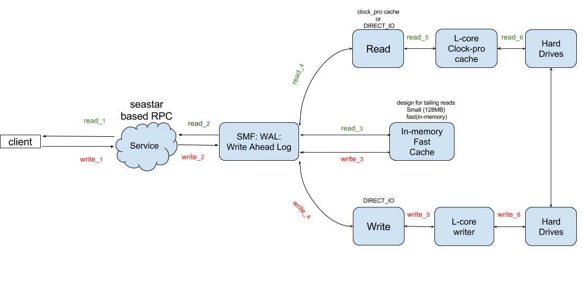
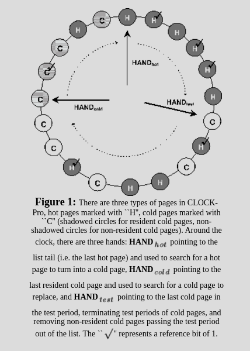

# Table of contents

**smf** is pronounced **/smɝf/**

---

[Intro](#Intro)

[RPC](#RPC)

[WAL](#WAL)

[Building](#Building)

[References](#References)


---

<a name="Intro"/>
# Intro

`smf` is a set of
[mechanically friendly](https://groups.google.com/forum/#!forum/mechanical-sympathy)
subsystems. It is the evolution of a set of distributed-sys primitives
I've worked since college - named `moondog` - updated to run under the
[seastar]((http://www.seastar-project.org/)
share-nothing paradigm.

The subproject
[smfb](https://github.com/senior7515/smf/tree/master/src/smfb)
was born out of the need to have a low latency queueing broker. During
my tenure at Concord.io, I struggled to provide low latency messaging
(single digit milliseconds) while providing exactly-once delivery of messages.
Ideally, the systems should **not** require API changes from a programmer's
point of view. That is, the programmer shouldn't have to implement
```cpp
    byte[] save_snapshot(time)
    set_snapshot(byte[], time)
```
Turns out what people want is exactly-once processing, **not**
exactly-once delivery, but that's another story.

## We need your help!

Simply send an email to the
[smf-dev mailing List](https://groups.google.com/forum/#!forum/smf-dev)
to get started. Or take a look at the issue list.

## Minor notes

The state of the subsystem completion is:

*    RPC - 100%
*    WAL - 100%
*    Chain Replication - 70%
*    Raft Consensus    - 40%

All subsystems they are built as separate static (.a) libraries that you can
link into your projects if you choose to just use a subsystem. I welcome build
system changes to *only* build necessary components. At the moment I plan to
use ALL components, and so all of them are built by default.

Please submit your changes with a decent set of unit tests and ideally
one integration test.

The next sections only cover subsytems that are 100% feature complete, and
have significant testing done. WIP (work-in-process) subsystems are not
documented yet.


<a name="RPC"/>
# RPC

`smf's` high level design of a “services” DSL and code generation is based on
the [Google Flatbuffers project](https://google.github.io/flatbuffers/) - a fast
cross language serialization format - and
[seastar](http://www.seastar-project.org/)
for its networking and thread model.

Behind the scenes Flatbuffers is a backing array + a field lookup table. Every
method call gets looked up on a vtable as an offset into the underlying array.
`struct`s and native (ints, doubles, bools) types are inlined. Although
Flatbuffers offers a C++, C#, C, Go, Java, JavaScript, PHP, and Python
serialization format, this proposal only focuses on the standardization of a
header and payload format, plus the seastar code generation and services
integration. This proposal doesn’t require any fundamental changes to any
seastar core functionality other than merging with, and extending the existing
RPC found in /seastar/rpc/*.{hh,cc}. Schema Definition

The schema definition is the full schema supported by Flatbuffers. The types
supported by the services framework, however, only operates on Flatbuffers
`Table`s. A table is a class in C++ that can contain pointer fields. This is the
main difference between a struct and a Table in flatbuffers terminology. To have
Table types is a requirement of the IDL (Flatbuffers) for both input (arguments)
and outputs (returned values). Example

```cpp
namespace smf_gen.fbs.rpc;

table Request { name: string; }
table Response { name: string; }

rpc_service SmfStorage {
    Get(Request):Response;
}
```
Generated code

The above IDL generates a client and a server per `rpc_service` as such (please
see full generated code here):

```cpp

class SmfStorageStorage: public smf::rpc_service { …
    virtual future<smf::rpc_envelope> Get(smf::rpc_recv_context rec); };
Smfs SmfStorageStorageClient: public smf::rpc_client { …
    future<smf::rpc_recv_ctx_t<Response>> GetSend(smf::rpc_envelope req); };

```

## High level design

The high level design for smf (this rpc system) is inspired by
facebook::wangle libraries with a usability improvement over regular RPC, i.e.:
just the method call by having hooks/callbacks at different stages of the
request lifecycle. The idea is that you can have hooks to deny or approve a
request as it traverses through the request pipeline.

```cpp
struct rpc_incoming_filter {
  future<std::experimental::optional<rpc_recv_context>>
  apply(rpc_recv_context ctx) = 0
  };
```


We want to support this for any number of “services” registered with the
`rpc_server` that runs this services. To achieve that there has to be someone
responsible for accepting or rejecting the requests handles. The current design
allows a user to register an infinite number of services, since the alternative
would be to run in multiple ports. This is true even if the services from from
different files/modules (generated or not). To achieve that, services register
with a router.

```cpp
class rpc_handle_router {
    bool can_handle_request(const uint32_t &request_id,
                            const flatbuffers::Vector<flatbuffers::Offset<fbs::rpc::DynamicHeader>>);

    void register_service(std::unique_ptr<rpc_service> s);

    future<rpc_envelope> handle(rpc_recv_context recv);

    void register_rpc_service(rpc_service *s);
};
```


The router is in fact very similar to the current seastar rpc system method function
dispatch by id(int). However the main design difference is that we should keep
the same id=same_handle even through multiple code generation phases, i.e.: when
you extend the schema. To achieve this the register services uses a simple XOR
hashing algorithm. Each method has an id + metadata, same with the service.

```cpp
struct rpc_service {

    virtual const char *service_name() const = 0;

    virtual uint32_t service_id() const = 0;

    virtual std::vector<rpc_service_method_handle> methods() = 0;
};


struct rpc_service_method_handle {
    const char *method_name;
    const uint32_t method_id;
    fn_t apply;
};
```


Given these 2 interfaces, we can come up with a request id.
`request_id = service->service_id() ^ method->method_id()`
This is how the requests are
tracked. Consistent requests_ids after multiple generations

```cpp
smf_service SmfStorageStorage {
    Put(Request):Response; // new method Put() added before the old method
    Get(Request):Response;
}
```

To keep the same `request_id` and
not break existing old clients, the `method_id` is simply the `crc_32` of the
`method name`. This is also true for service_id being the `crc_32` of the service
name. This guarantees consistent `request_id`’s allowing for the evolution of
services without breaking existing client’s api. Tie it all together, how does
it work:

```cpp
    bool rpc_handle_router::can_handle_request(request_id, header_map);
```

The last part we have yet to explain is how does request lookup work on
the server side.
Assuming a fully parsed request (see low level details section), we have a
`request_id` that is set by the client, which we generate. The service driver,
aka the `rpc_server.h` will perform a map lookup of the
`request_id ( XOR( service_id, method_id ) )`
and determine if we have a function handler for it or not. If we
do, we simply call:

```cpp
    future<rpc_envelope>  rpc_handle_router::handle(rpc_recv_context recv);
```

To handle the actual method call.
[Here are fully worked out examples]()


## Frame format

The frame format is simply a 12 byte (4 int32_t) header and a payload.

This is in fact similar how the current rpc framework works for seastar,
after frame
negotiation. This fixed format makes it very easy to work w/ the existing
abstractions of seastar input_stream<char>::read_exactly(12). The reason for
this format also being generated by flatbuffers is that this ensures
compatibility w/ other languages such as Python, Ruby, Java which is a major
goal for even building this proof of concept, without having to manually
replicate the struct alignment and bit shifting to construct a header and a
payload in the right format. At it’s core, the header is a tuple of:
`(payload size, bit flags, checksum)`
The payload, just ships around a byte array. There are 2
extra fields in the payload.

```cpp

struct Payload{
    ...
    meta: uint
    dynamic_headers: [DynamicHeader] .
};

```

The headers are used for tracing (ala Google Dapper) as well as extensibility,
i.e.: supporting json as the payload. All values are **binary**, the keys are
the only plain text.
The meta field is used on the client side
to send the request_id and on it’s way back it’s used to report status of a call
(when a call has no returned payload). Together, the header and payload are
called the “envelope format” Frame Format [full flatbuffers]():

```cpp
enum Flags:uint (bit_flags) {
    CHECKSUM,
    VERIFY_FLATBUFFERS,
    COMPRESS_SNAPPY
}


struct Header {
    size: uint;
    flags: Flags = 0; // bit flags. i.e.: 2,4,8,16…
    checksum: uint;
};

table Payload {
    meta: uint
    dynamic_headers: [DynamicHeader];
    body: [ubyte];
}


```

## Compiler / Codegen

The compiler is based on the flatbuffers::Parser, which makes it easy to extend
since we get a fully parsed structure including “rpc_service”, so the only thing
to do is to actually output the string. The parsing, tokenization, validation is
left up to the flatbuffers::Parser class. The code generation is only a few
hundred lines of code and can be found here.

## Metrics

The prototype will also include the
famous High Dynamic Range Histogram (HDR Hist) from Gil Tene’s High to track the
latency distribution of RPC requests. Future extensions of the RPC planned to
have Google dapper style tracing for RPC calls which I’ve already implemented on
a proprietary system at concord.io and can easily port.

### Similarities with existing rpc

This is very similar to [Cap'n Proto](https://capnproto.org/).
In fact look at the future API used and
returned. However, the networking mechanism used is seastar and the
serialization mechanism is flatbuffers. This project just glues them together.

**No serialization**. There is no manual or codegen serialization code. In fact the
“serialization” is done at the client side, aligning the bytes in a way that the
receiving party doesn’t have to do any work other than a pointer cast to your
type:

```cpp
    auto t = (MyType*)payload->mutable_body();
    t->name(); // or any other method

```

Internally this works in a similar way to a std::vector<uint8_t>, where
every time you save a field, it will try to write it, and if it ran out of
scape, it will realloc to a new location so that it’s all on a single byte array
before sending to the server.

<a name="WAL"/>
# WAL

WAL - write ahead log - is typically used to provide atomicity and
durability. Most distributed systems that manipulate data with promises of
recovering your data after a crash use a form of a WAL - including databases:
[Cassandra](https://cassandra.apache.org/),
[PostgreSQL](https://www.postgresql.org/),
[MySQL](https://www.mysql.com/),
[Scylla](http://www.scylladb.com/),
[Kudu](https://kudu.apache.org/)
, filesystems:
[JFS](https://en.wikipedia.org/wiki/Journaling_file_system)
, even embedded databases:
[SQLite](https://www.sqlite.org/),
[RocksDB](http://rocksdb.org/), etc,
to name a few - there are very very many more.

We provide a WAL abstraction that is very performant. It uses the
O_DIRECT capabilities of the seastar filesystem API for both reads and writes.
It also provides hooks into the IO Scheduler of seastar to prioritize requests,
specially invalidations - abort transaction. On the read side, we implement
the patent-free
[clock-pro](http://static.usenix.org/event/usenix05/tech/general/full_papers/jiang/jiang_html/html.html)
algorithm for page caching and eviction. Each file
open has a deterministic memory footprint, so you know exactly how much memory
your application will use. Specifically, you know exactly how many file handles
you can have open in the worst case.

Although configurable, the expected memory footprint per **file** is this:

```cpp

    // either 10% or 10 pages. If file has less than 10 pages, then all
    // each page is typically 4096 - pulled dynamically from sysconf()
    // per filesystem

    const auto percent     = uint32_t(number_of_pages * .10);
    const auto min_default = std::min<uint32_t>(10, number_of_pages);
    max_resident_pages_    = std::max<uint32_t>(min_default, percent);
```



The page caching and eviction algorithm can be succinctly described from the
authors (Feng Chen and Xiaodong Zhang) paper:



Note: since we don't use the OS page cache, we MUST do page caching at the
application level.

## Code usage

There is a [fully worked out example](https://github.com/senior7515/smf/blob/master/src/integration_tests/wal/main.cc)
and integration test, but here is the gist:

```cpp

// please see fully worked out example on our integration tests

int main(int args, char **argv, char **env) {
  app_template app;
  distributed<smf::shardable_wal> w;
  return app.run(args, argv, [&]() mutable -> future<int> {
    return w
        .start(smf::wal_type::wal_type_disk_with_memory_cache,
               smf::wal_opts("."))
        .then([&w] { return w.invoke_on_all(&smf::shardable_wal::open); })
        .then([&w] {
          return x.append(gen_payload(kPayload)).then([&x](uint64_t i) {
            return make_ready_future<int>(0);
          });
        });
  });
}


```

1. `smf::wal_type::wal_type_disk_with_memory_cache` instantiates
the wal present in the diagram above. This is a pluggable interface,
and the only implementation availabe at the moment.
2. to use it is as simple as `wal.append(gen_payload(kPayload))`. done

## Seastar Friendly

Notice that the API is a `smf::shardable_wal` which means it expects to work
within the seastar framework. i.e.: it should have a member function called
`future<> stop()`. See the public api at
[wal.h](https://github.com/senior7515/smf/blob/master/src/filesystem/wal.h)


Additionally, the `smf::wal_type::wal_type_disk_with_memory_cache`
implementation - which as the name describe is a write ahead log that
uses the disk and has a memory cache :) - has a
[wal_file_name_mender.h](https://github.com/senior7515/smf/blob/master/src/filesystem/wal_file_name_mender.h)
which fixes the names of previously locked files at startup before ANY
readers and writers start.

In pseudo code this is what happens:

```cpp

0. Start one write-ahead-log **per** shard (l-core)

// Each l-core write-ahead-log will do:

1. detect and recover from crash (for this l-core map)
   this means that we use google-consistent-jump-hash to map
   previous runs to this l-core, and ONLY fix this l-core's crashes

2. Start the writer, first get file properties (for this l-core)
3. Start the readers (for this l-core)


```

That is to say, there is **exactly** one writer and reader **per** l-core.

You can find out how many logical cores are running on your system by doing:

```bash
#!/bin/bash
grep -c ^processor /proc/cpuinfo
```

Last, each `*.wal` file is rotated every 64MB. See
[wal_file_size_aligned()](https://github.com/senior7515/smf/blob/master/src/filesystem/wal_writer_utils.cc#L10)
for implementation details.

<a name="Building"/>
# Building

These are the core pattern directives

```
%c  core file size soft resource limit of crashing process (since Linux 2.6.24)
%d  dump mode—same as value returned by prctl(2) PR_GET_DUMPABLE (since Linux 3.7)
%e  executable filename (without path prefix)
%E  pathname of executable, with slashes ('/') replaced by exclamation marks ('!') (since Linux 3.0).
%g  (numeric) real GID of dumped process
%h  hostname (same as nodename returned by uname(2))
%i  TID of thread that triggered core dump, as seen in the PID namespace in which the thread resides (since Linux 3.18)
%I  TID of thread that triggered core dump, as seen in the initial PID namespace (since Linux 3.18)
%p  PID of dumped process, as seen in the PID namespace in which the process resides
%P  PID of dumped process, as seen in the initial PID namespace (since Linux 3.12)
%s  number of signal causing dump
%t  time of dump, expressed as seconds since the Epoch, 1970-01-01 00:00:00 +0000 (UTC)
%u  (numeric) real UID of dumped process

```

```
 # This is what I set my core dump as. A bit verbose, but easy to read
 root$ echo 'core_dump.file_name(%e).signal(%s).size(%c).process_id(%p).uid(%u).gid(%g).time(%t).initial_pid(%P).thread_id(%I)' > /proc/sys/kernel/core_pattern
```

## Getting started on Fedora 25

I develop this system on a Fedora25, gcc6 environment. If you have that
environment, the build system, transitive dependencies, etc are all automated.

Simply run:

```bash
 root$ cd $ROOT/meta
 root$ source source_ansible_bash
 root$ ansible-playbook playbooks/devbox_all.yml
```

We welcome contributions to port `smf` to other platforms, and OS's.

## asciinema

[](https://asciinema.org/a/1u2j8vg20813jxmgbky7liwxr?autoplay=1&loop=1&speed=2)

<a name="References"/>
# References

* [Persistent memory programming - pmem](http://pmem.io/)
* [Seastar Project](http://www.seastar-project.org/)
* [Data plane developtment kit - DPDK](http://dpdk.org/)
* [RAMCloud](https://ramcloud.atlassian.net/wiki/download/attachments/6848571/RAMCloudPaper.pdf)
* [Making lockless synchronization fast: performance implications of memory reclamation1](http://doi.ieeecomputersociety.org/10.1109/IPDPS.2006.163)
* [All files are not created equal: On the complexity of crafting crash-consistent applications](http://research.cs.wisc.edu/wind/Publications/alice-osdi14.pdf)
* [File consistency - danluu's blog post](http://danluu.com/file-consistency/)
* [Kafka Exactly Once](https://docs.google.com/document/d/11Jqy_GjUGtdXJK94XGsEIK7CP1SnQGdp2eF0wSw9ra8/edit)
* [flatbuffers](https://google.github.io/flatbuffers/)
* [seastar](http://www.seastar-project.org/)
* [gRPC](http://grpc.io)
* [Cassandra](https://cassandra.apache.org/)
* [PostgreSQL](https://www.postgresql.org/)
* [MySQL](https://www.mysql.com/)
* [Scylla](http://www.scylladb.com/)
* [Kudu](https://kudu.apache.org/)
* [Clock-pro caching algorithm](http://static.usenix.org/event/usenix05/tech/general/full_papers/jiang/jiang_html/html.html)
* [Cap'n Proto](https://capnproto.org/)
